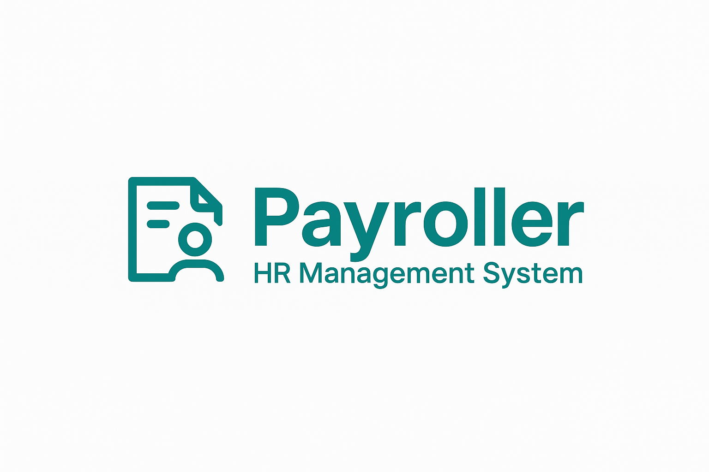

> **Employee & Payroll Management System**

[](https://fastapi.tiangolo.com/)
[](https://reactjs.org/)
[](https://www.typescriptlang.org/)
[](https://www.postgresql.org/)

**PayRoller** is a modern HR management system designed for small and medium-sized businesses. Built with **FastAPI (Python)** for the backend and **Vite + ReactJS + TypeScript** for the frontend, PayRoller helps you centralize employee information and automate payroll processing, making HR tasks easier, faster, and more reliable.

---

## ✨ Key Features

### 👥 Employee Management

- Centralized database for all employee records
- Add, edit, delete, and search employees
- Store personal, contact, department, and salary details
- Clean and responsive user interface

### 💰 Payroll & Payslip Management

- Generate monthly payslips for each employee
- Track base salary, bonuses, deductions, and net pay
- Export payslips as PDF or Excel for easy sharing

### 🔐 Authentication & Security

- Secure login for HR and admin roles
- Role-based access control for sensitive operations

### 🚀 Modern Tech Stack

- **Backend:** FastAPI (Python), PostgreSQL
- **Frontend:** Vite, ReactJS, TypeScript
- **Deployment:** Dockerized for easy deployment

---

## 🚀 Getting Started

### Prerequisites

- Python 3.8 or higher
- Node.js 18 or higher
- PostgreSQL
- Docker & Docker Compose (recommended for deployment)

### Quick Start

1. Clone the repository and enter the project directory.
2. Set up the backend: create a virtual environment, install dependencies, run migrations, and start the FastAPI server.
3. Set up the frontend: install dependencies and start the development server.
4. Alternatively, use Docker Compose to run the whole stack locally with one command.

---

## 📁 Project Structure

```
payroller/
├── backend/           # FastAPI backend code (models, schemas, CRUD, API)
├── frontend/          # Vite + React frontend code (components, pages, API)
└── docker-compose.yml # For local multi-service orchestration
```

---

## 📋 License

This project is proprietary. Please contact the author for commercial use or licensing information.

---

## 🗺️ Roadmap

- Employee self-service portal
- Leave and attendance management
- Performance reviews
- Department and role management
- Advanced analytics and reporting

---

## 🤝 Contributing

Pull requests are welcome! For major changes, please open an issue first to discuss what you would like to change.

---

## 📞 Contact

For questions, support, or licensing, please contact: ngmhah@gmail.com

---

**PayRoller** – *Simplify your HR, streamline your payroll!*

